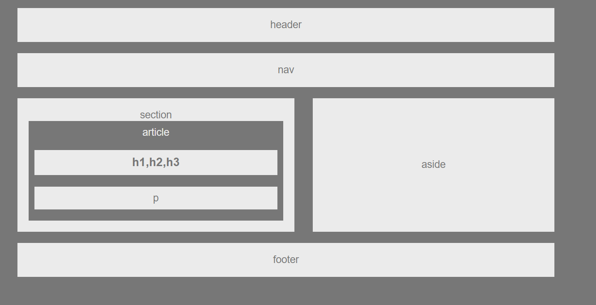

# HW-Wireframe
## Technology
- HTML
- CSS

By doing this homework, I learn how to center the text, how I can change the color of the background and the basic layout of a webpage

I figured how I can put P and h1,h2, h3 inside of article container, and section as the parent container
```HTML    
    <section id="section">
      section
    
    <article id="article">
      article
    
    <h1 id="h1">
      h1,h2,h3
    </h1>
    
    <p id="p">
      p
    </p>
```

Please find the preview of my HW-Wireframe homework

